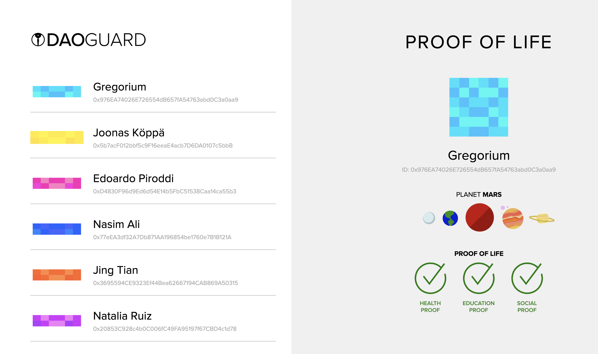

# DAO-Guard
DAO Guard protects your DAOs with Proof of Life.

DAO Guard is a plugin that can be attached to any DAO to verify the Proof of Life of its participants. Users in the DAO that don't have a proven track record of having existed for a considerable period of time will not be able to participate in voting for important matters.

The Proof of Life is based on Smart contracts that can be programmed to track any events of one's life, starting from birth. Any recordable event, such as doctor visits, social gatherings and official meetings, will work as a proof that the individual, has indeed had a life (i.e. isn't a bot or a made up person).

This prototype has been deployed to the **Goerli testnet** and requires Metamask or another wallet provider to run.

[Live demo at GitHub Pages](https://jookop.github.io/DAO-Guard/).

# Running
Run `npm run start` to run the project at port 3000.
Or see [Live demo at GitHub Pages](https://jookop.github.io/DAO-Guard/).
